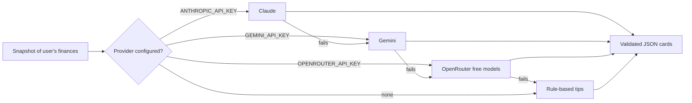

# Personal Finance App

A budgeting app for tracking transactions, budgets, savings pots and recurring bills, with AI-generated spending recommendations. Built with Next.js 14 (App Router), TypeScript, Supabase and Tailwind CSS.

<!-- Add a screenshot of the Overview page here:  -->

## Features

- **Overview dashboard**: balance, income and expenses, with summaries of pots, budgets, recent transactions and upcoming bills
- **Transactions**: search, sort, filter by category, and paginate
- **Budgets**: monthly limits per category, with a spending chart and the latest spending in each category
- **Savings pots**: targets with progress bars; add or withdraw money
- **Recurring bills**: paid, due-soon and upcoming status for each bill
- **Transfers**: send money to another user by account ID
- **AI insights**: personalised recommendations from your budgets, pots and bills
- **Responsive**: works from 320px phones up to wide desktops

## AI insights

The Overview page generates three or four recommendations from a snapshot of the user's finances. The snapshot includes budget limits against the last 30 days of spending, unbudgeted categories, pot progress, recurring bills and recent transactions. Names and account IDs are not included.



- **Structured output**: every provider is asked for the same JSON schema, and responses are validated with Zod before they're shown. Categories and priorities that don't match are mapped to safe defaults instead of failing the whole response.
- **Graceful fallback**: each configured provider is tried in turn. Rate limits, bad keys, overloaded free models and unreadable replies fall through to the next provider, and finally to rule-based tips computed from the user's own numbers. The card explains why a fallback was used.
- **Cost control**: generation is on demand and cached per user for an hour, keyed on a hash of the snapshot, so repeat views don't call the API again.

The logic is in [`app/_lib/insights.ts`](app/_lib/insights.ts) (providers) and [`app/_lib/insights-core.ts`](app/_lib/insights-core.ts) (snapshot, schema and rules, unit tested).

## Security model

- **Sessions**: authentication uses Supabase Auth with [`@supabase/ssr`](https://supabase.com/docs/guides/auth/server-side/nextjs). Every server action gets the user from a session verified with Supabase; nothing trusts client-supplied IDs.
- **Row-level security**: users can only read and change their own `owners` and `accountsTrx` rows ([migration](supabase/migrations/0001_rls_and_transfers.sql)).
- **Atomic transfers**: `transfer_money()` is a Postgres function that checks the amount, the sender's balance and the receiver, locks both accounts in a fixed order, and updates them in one transaction.
- **Input validation**: budget, pot, transfer and profile inputs are validated server-side with Zod.

## Tech stack

| Area          | Tools                                                         |
| ------------- | ------------------------------------------------------------- |
| Framework     | Next.js 14 (App Router, Server Actions), React 18, TypeScript |
| Data and auth | Supabase (Postgres, Auth, Storage), row-level security        |
| UI            | Tailwind CSS, Recharts, React Hook Form, React Icons          |
| AI            | Anthropic SDK, Google Gen AI SDK, OpenRouter, Zod             |
| Quality       | Vitest, ESLint, Prettier, GitHub Actions CI                   |

## Getting started

### 1. Install

```bash
git clone <your-repo-url>
cd personal-finance-app
npm install
```

### 2. Configure environment

Copy `.env.example` to `.env.local` and fill in your Supabase URL and anon key (Supabase dashboard: **Project Settings → API**). The AI keys are optional; without them the app shows rule-based tips.

| Variable                   | Required | Notes                                                           |
| -------------------------- | -------- | --------------------------------------------------------------- |
| `NEXT_PUBLIC_SUPABASE_URL` | Yes      |                                                                 |
| `NEXT_PUBLIC_SUPABASE_KEY` | Yes      | Anon (public) key                                               |
| `ANTHROPIC_API_KEY`        | No       | Claude, paid                                                    |
| `GEMINI_API_KEY`           | No       | Free tier at [aistudio.google.com](https://aistudio.google.com) |
| `OPENROUTER_API_KEY`       | No       | Free models at [openrouter.ai](https://openrouter.ai)           |

### 3. Set up the database

The app expects two tables:

- `owners`: `user_id`, `name`, `email`, `avatar`, `isDemo`
- `accountsTrx`: `owners_id`, plus JSON columns `transactions`, `budgets`, `pots` and `balance`

Then run [`supabase/migrations/0001_rls_and_transfers.sql`](supabase/migrations/0001_rls_and_transfers.sql) in the Supabase SQL Editor to enable row-level security and create the transfer functions. For avatar uploads, create a public storage bucket named `avatars`.

### 4. Run

```bash
npm run dev
```

Sign up with **Start with demo transactions** ticked to get sample data.

## Scripts

| Command             | What it does                 |
| ------------------- | ---------------------------- |
| `npm run dev`       | Start the development server |
| `npm run build`     | Production build             |
| `npm test`          | Run unit tests (Vitest)      |
| `npm run lint`      | ESLint                       |
| `npm run typecheck` | TypeScript check             |
| `npm run format`    | Format with Prettier         |

## Project structure

```
app/
  _components/      UI by feature (overview, budgets, pots, transactions, ...)
  _lib/
    actions.ts      Server actions for data, auth and money movement
    insights.ts     AI provider chain (server action)
    insights-core.ts  Snapshot, schema and rule-based fallback (tested)
    supabase/       Server, browser and middleware Supabase clients
  (routes)          /, /transactions, /budgets, /pots, /recurring_bills, /settings
supabase/migrations/  Row-level security and database functions
middleware.ts       Session refresh and route protection
```

## Credits

This project builds on [theMystic1/personal-finance-app](https://github.com/theMystic1/personal-finance-app), an implementation of the [Frontend Mentor personal finance app](https://www.frontendmentor.io/challenges/personal-finance-app-JfjtZgyMt1) design challenge.

Changes in this fork:

- Replaced cookie-based identity with Supabase SSR sessions, row-level security and an atomic transfer function
- Added the AI insights feature with multiple providers and a rule-based fallback
- Added server-side validation, error handling in forms, and fixed budget deletion
- Redesigned the UI and made every page responsive
- Added unit tests, CI, Prettier and this documentation
